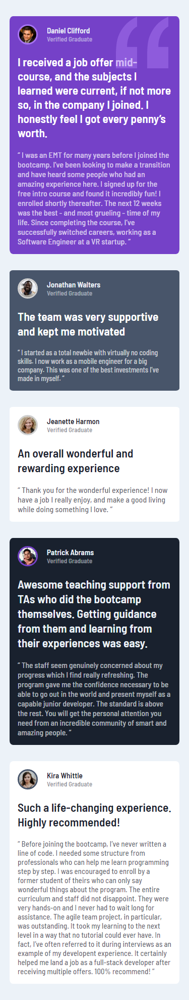
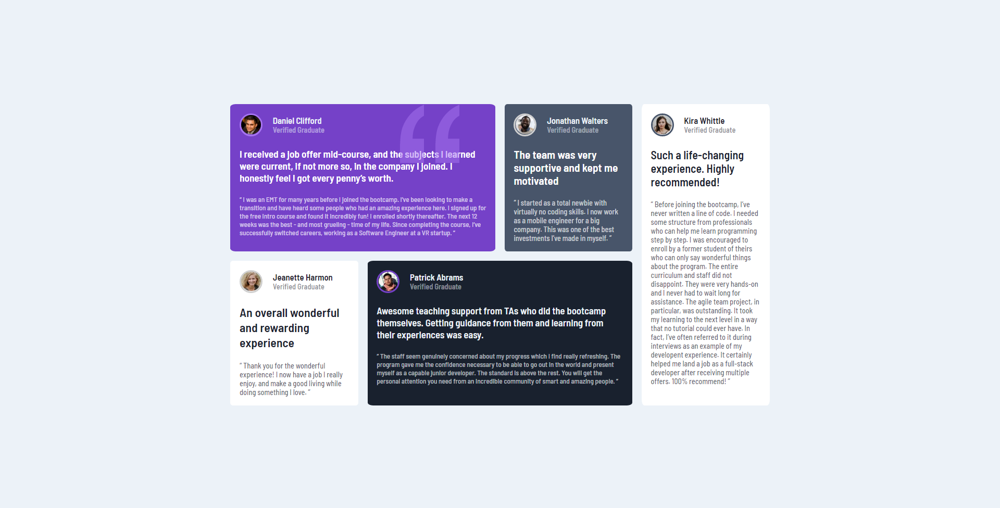

# Frontend Mentor - Testimonials grid section solution

This is a solution to the [Testimonials grid section challenge on Frontend Mentor](https://www.frontendmentor.io/challenges/testimonials-grid-section-Nnw6J7Un7). Frontend Mentor challenges help you improve your coding skills by building realistic projects.

## Table of contents

- [Overview](#overview)
  - [The challenge](#the-challenge)
  - [Screenshot](#screenshot)
  - [Links](#links)
- [My process](#my-process)
  - [Built with](#built-with)
  - [What I learned](#what-i-learned)
  - [Continued development](#continued-development)
  - [Useful resources](#useful-resources)
- [Author](#author)

## Overview

### The challenge

Users should be able to:

- View the optimal layout for the site depending on their device's screen size

### Screenshot

#### Mobile Design

> 

#### Desktop Design

> 

### Links

- Solution URL: [Add solution URL here](https://your-solution-url.com)
- Live Site URL: [testimonial-grid-section-nain](https://lenugo.github.io/testimonials-grid-section-main/)

## My process

### Built with

- Semantic HTML5 markup
- [SASS](https://sass-lang.com/) - For styles
- Flexbox
- CSS Grid
- Mobile-first workflow

### What I learned

I learned how to use the `@content;` directive:

```css
@mixin media($width) {
  @media only screen and (max-width: $width) {
    @content;
  }
```

### Continued development

Use this section to outline areas that you want to continue focusing on in future projects. These could be concepts you're still not completely comfortable with or techniques you found useful that you want to refine and perfect.

### Useful resources

- [Sass/guide](https://sass-lang.com/guide) - This is guide for learn sass.

## Author

- Github User - [Lenugo](https://github.com/Lenugo)
- Frontend Mentor - [@Lenugo](https://www.frontendmentor.io/profile/Lenugo)
